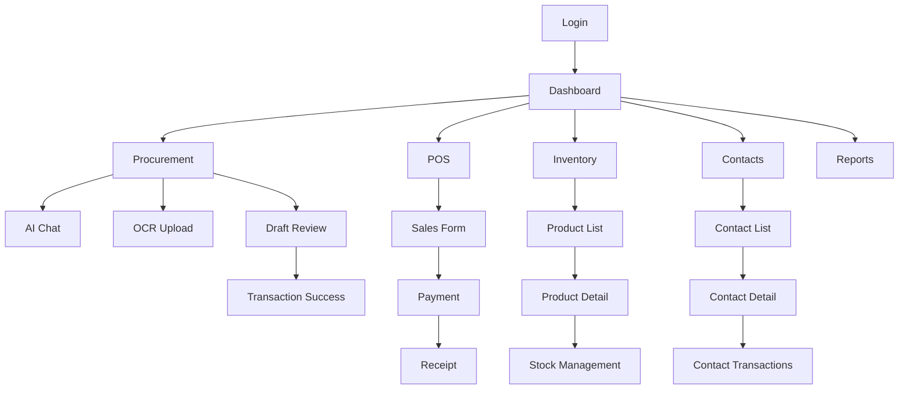

## 1. Product Overview
Aplikasi web DNN Project adalah sistem manajemen bisnis terintegrasi yang melengkapi aplikasi mobile existing, dengan fokus pada procurement (pengadaan), inventory management, dan point of sales. Aplikasi ini memanfaatkan AI untuk mempermudah input data melalui chat dan OCR, serta menyediakan dashboard komprehensif untuk monitoring bisnis.

Target user adalah pemilik usaha dan staf yang membutuhkan solusi lengkap untuk mengelola transaksi bisnis, inventory, dan kontak pelanggan/supplier dengan efisiensi tinggi.

## 2. Core Features

### 2.1 User Roles
| Role | Registration Method | Core Permissions |
|------|---------------------|------------------|
| Admin | Manual setup by developer | Full access to all features, user management, system configuration |
| Staff | Admin invitation/registration | Access to transaction, product, and contact management |
| Viewer | Admin assignment | Read-only access to reports and dashboard |

### 2.2 Feature Module
Aplikasi web DNN Project terdiri dari fitur utama berikut:

1. **Dashboard**: Overview bisnis, grafik penjualan, status inventory, quick actions
2. **Procurement**: AI Chat untuk input pembelian, OCR upload struk, manajemen supplier
3. **Point of Sales**: Kasir penjualan, manajemen pelanggan, pembayaran
4. **Inventory Management**: Daftar produk, stock tracking, history transaksi
5. **Contact Management**: Pelanggan dan supplier, histori transaksi per kontak
6. **Reports & Analytics**: Laporan penjualan, inventory reports, analisis bisnis

### 2.3 Page Details

| Page Name | Module Name | Feature description |
|-----------|-------------|---------------------|
| Dashboard | Overview Cards | Menampilkan total penjualan hari ini, total produk, low stock alerts, dan overdue tasks |
| Dashboard | Sales Chart | Grafik penjualan harian/mingguan/bulanan dengan filter tanggal |
| Dashboard | Quick Actions | Tombol cepat untuk tambah transaksi, tambah produk, scan struk |
| Dashboard | Recent Activities | List 10 transaksi terakhir dengan status dan nominal |
| Procurement | AI Chat Interface | Input pembelian melalui chat natural language dengan konteks produk existing |
| Procurement | OCR Upload | Upload gambar struk untuk ekstraksi otomatis data pembelian |
| Procurement | Draft Review | Review dan edit hasil ekstraksi AI sebelum commit ke database |
| Procurement | Supplier Management | Tambah/edit supplier, auto-match supplier existing berdasarkan nama |
| POS | Sales Form | Form penjualan dengan produk search, qty input, dan perhitungan otomatis |
| POS | Customer Selection | Pilih pelanggan existing atau tambah pelanggan baru |
| POS | Payment Processing | Multiple payment methods (cash, transfer, qris) dengan kalkulasi kembalian |
| POS | Receipt Generation | Generate dan print receipt dengan nomor invoice otomatis |
| Inventory | Product List | Daftar produk dengan search, filter kategori, status stock |
| Inventory | Product Detail | Detail produk termasuk stock history, harga beli/rata-rata, harga jual |
| Inventory | Stock Management | Tambah stock manual, adjust stock, tracking perubahan stock |
| Inventory | Product Edit | Edit nama, harga, kategori, variant produk |
| Contacts | Contact List | Daftar kontak dengan filter customer/supplier, search by name/phone |
| Contacts | Contact Detail | Profile kontak dengan histori transaksi dan statistik |
| Contacts | Contact Form | Tambah/edit kontak dengan validasi data |
| Reports | Sales Report | Laporan penjualan per periode dengan grafik dan export PDF |
| Reports | Inventory Report | Laporan stock movement, produk terlaris, stock value |
| Reports | Contact Report | Analisis kontak berdasarkan frequency dan value transaksi |

## 3. Core Process

### Procurement Flow
1. User memilih metode input: AI Chat atau OCR Upload
2. Sistem mengekstrak data dan menampilkan draft
3. User mereview dan melakukan edit jika diperlukan
4. Sistem melakukan validasi dan menyarankan supplier/product match
5. User konfirmasi dan commit transaksi
6. Sistem update stock dan simpan ke database

### POS Flow
1. User scan atau search produk
2. Input quantity dan pilih customer
3. Sistem hitung total dan pilih payment method
4. Process payment dan generate invoice
5. Update stock dan simpan transaksi

### Page Navigation Flow

## 4. User Interface Design

### 4.1 Design Style
- **Primary Colors**: Blue (#2563eb) untuk primary actions, Green (#10b981) untuk success states
- **Secondary Colors**: Gray (#6b7280) untuk secondary text, Red (#ef4444) untuk errors
- **Button Style**: Rounded corners (8px radius), hover states dengan opacity 0.9
- **Typography**: Inter font family, heading 24-32px, body 14-16px
- **Layout**: Card-based design dengan shadow-sm, top navigation dengan logo dan user menu
- **Icons**: Heroicons untuk konsistensi, emoji untuk status indicators

### 4.2 Page Design Overview

| Page Name | Module Name | UI Elements |
|-----------|-------------|-------------|
| Dashboard | Overview Cards | Grid 2x2 cards dengan icon, angka besar, dan trend indicators |
| Dashboard | Sales Chart | Line chart dengan tooltip interactive, legend di bawah |
| Procurement | AI Chat | Chat interface mirip WhatsApp dengan bubble messages, input di bawah |
| Procurement | OCR Upload | Drag-drop area dengan preview gambar, progress bar saat upload |
| POS | Sales Form | Table produk dengan subtotal otomatis, sticky footer untuk total |
| Inventory | Product List | Table dengan sorting, filter chips di atas, pagination di bawah |
| Contacts | Contact List | Card layout untuk mobile, table untuk desktop dengan avatar |

### 4.3 Responsiveness
- Desktop-first approach dengan breakpoint: 768px (tablet), 1024px (desktop)
- Mobile navigation menggunakan bottom tab bar mirip aplikasi native
- Touch-friendly buttons dengan minimum 44px height
- Responsive tables dengan horizontal scroll pada mobile
- Collapsible sidebar untuk screen < 1024px

### 4.4 3D Scene Guidance
Tidak applicable untuk aplikasi ini - fokus pada 2D web interface dengan performa optimal.