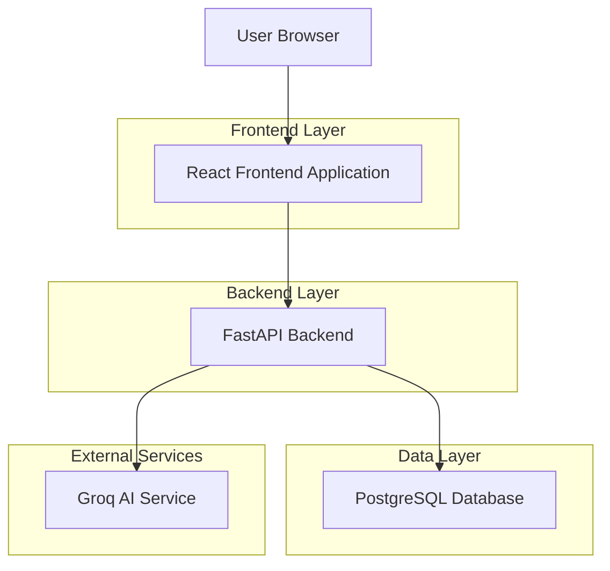
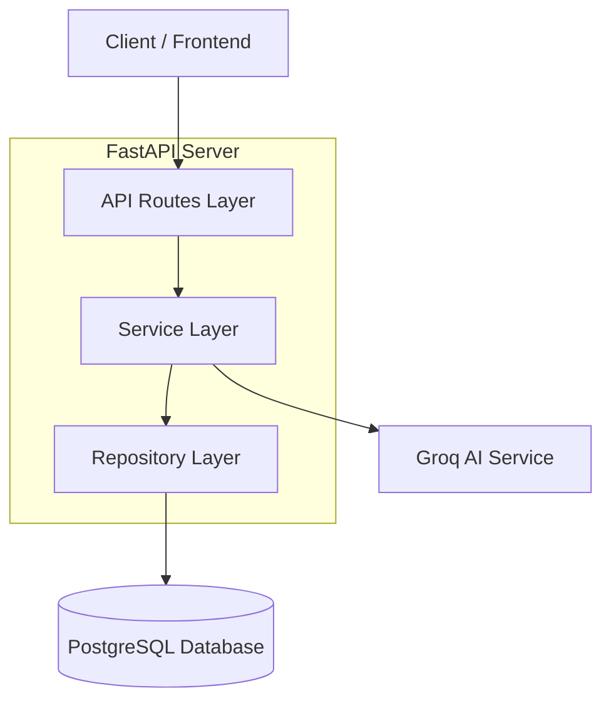
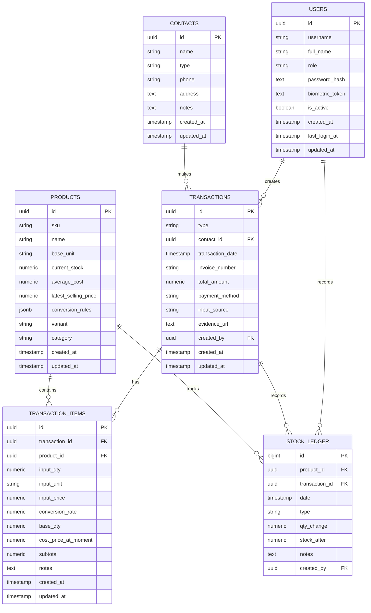

## 1. Architecture design



## 2. Technology Description

- **Frontend**: React@18 + tailwindcss@3 + vite
- **Initialization Tool**: vite-init
- **Backend**: FastAPI (existing)
- **Database**: PostgreSQL (existing)
- **AI Service**: Groq API (existing integration)
- **State Management**: React Context + useReducer
- **HTTP Client**: Axios
- **UI Components**: HeadlessUI + Heroicons
- **Form Validation**: React Hook Form + Zod
- **Charts**: Chart.js atau Recharts

## 3. Route definitions

| Route | Purpose |
|-------|---------|
| / | Dashboard utama dengan overview bisnis |
| /login | Halaman login untuk autentikasi user |
| /procurement | Halaman procurement dengan AI chat dan OCR |
| /procurement/chat | AI chat interface untuk input pembelian |
| /procurement/ocr | Upload dan preview hasil OCR |
| /procurement/draft | Review dan edit draft transaksi |
| /pos | Point of Sales interface |
| /pos/new | Form penjualan baru |
| /inventory | Daftar produk dan inventory |
| /inventory/products | List semua produk |
| /inventory/products/:id | Detail produk dengan history |
| /inventory/stock | Manajemen stock dan adjustment |
| /contacts | Daftar kontak pelanggan dan supplier |
| /contacts/customers | List pelanggan |
| /contacts/suppliers | List supplier |
| /contacts/:id | Detail kontak dengan histori transaksi |
| /reports | Halaman laporan dan analytics |
| /reports/sales | Laporan penjualan |
| /reports/inventory | Laporan inventory |
| /reports/contacts | Analisis kontak |

## 4. API definitions

### 4.1 Authentication APIs

```
POST /api/auth/login
```

Request:
| Param Name | Param Type | isRequired | Description |
|------------|-------------|-------------|-------------|
| username | string | true | Username atau email |
| password | string | true | Password (plain text) |

Response:
| Param Name | Param Type | Description |
|------------|-------------|-------------|
| token | string | JWT token untuk autentikasi |
| user | object | User data (id, name, role) |

### 4.2 Procurement APIs

```
POST /api/v1/parse/text
```

Request:
| Param Name | Param Type | isRequired | Description |
|------------|-------------|-------------|-------------|
| new_message | string | true | Input teks dari user |
| current_draft | object | false | Draft context untuk follow-up |

Response: ProcurementDraft object dengan extracted items dan supplier info

```
POST /api/v1/parse/image
```

Request: Multipart form dengan file gambar dan current_draft_str (JSON string)

Response: ProcurementDraft object dengan hasil OCR

```
POST /api/v1/transactions/commit
```

Request: CommitTransactionInput dengan supplier info dan items

Response: CommitTransactionResponse dengan transaction_id dan status

### 4.3 Product APIs

```
GET /api/v1/products
```

Query Parameters:
| Param Name | Param Type | Description |
|------------|-------------|-------------|
| status | string | Filter: 'all', 'low_stock', 'out_of_stock' |

Response: Array of ProductListItem objects

```
GET /api/v1/products/:id
```

Response: ProductDetailResponse dengan detail lengkap dan history

```
PUT /api/v1/products/:id
```

Request: ProductUpdateInput dengan field yang ingin diupdate

### 4.4 Contact APIs

```
GET /api/v1/contacts
```

Query Parameters:
| Param Name | Param Type | Description |
|------------|-------------|-------------|
| type | string | Filter: 'CUSTOMER', 'SUPPLIER', atau null untuk all |

Response: Array of ContactItem objects

```
POST /api/v1/contacts
```

Request: ContactCreateInput dengan data kontak baru

```
PUT /api/v1/contacts/:id
```

Request: ContactUpdateInput dengan data yang ingin diupdate

### 4.5 Transaction APIs

```
GET /api/v1/transactions
```

Query Parameters:
| Param Name | Param Type | Description |
|------------|-------------|-------------|
| limit | number | Jumlah record (default: 20) |
| offset | number | Offset untuk pagination |
| contact_id | string | Filter by contact ID |

Response: Array of TransactionListItem objects

```
GET /api/v1/transactions/:id
```

Response: TransactionDetailResponse dengan items detail

## 5. Server architecture diagram



## 6. Data model

### 6.1 Data model definition



### 6.2 Frontend Project Structure

```
src/
├── components/
│   ├── common/
│   │   ├── Button.jsx
│   │   ├── Input.jsx
│   │   ├── Modal.jsx
│   │   └── Table.jsx
│   ├── dashboard/
│   │   ├── OverviewCards.jsx
│   │   ├── SalesChart.jsx
│   │   └── RecentActivities.jsx
│   ├── procurement/
│   │   ├── AIChat.jsx
│   │   ├── OCRUpload.jsx
│   │   └── DraftReview.jsx
│   ├── pos/
│   │   ├── SalesForm.jsx
│   │   ├── PaymentModal.jsx
│   │   └── Receipt.jsx
│   ├── inventory/
│   │   ├── ProductList.jsx
│   │   ├── ProductDetail.jsx
│   │   └── StockAdjustment.jsx
│   └── contacts/
│       ├── ContactList.jsx
│       └── ContactDetail.jsx
├── pages/
│   ├── Dashboard.jsx
│   ├── Procurement.jsx
│   ├── POS.jsx
│   ├── Inventory.jsx
│   ├── Contacts.jsx
│   └── Reports.jsx
├── services/
│   ├── api.js
│   ├── auth.js
│   ├── products.js
│   ├── transactions.js
│   └── contacts.js
├── hooks/
│   ├── useAuth.js
│   ├── useProducts.js
│   └── useTransactions.js
├── utils/
│   ├── formatters.js
│   ├── validators.js
│   └── constants.js
└── App.jsx
```

### 6.3 Environment Configuration

```env
# .env
VITE_API_BASE_URL=http://localhost:8000
VITE_APP_NAME=DNN Project Web
VITE_APP_VERSION=1.0.0
```

### 6.4 Package Dependencies

```json
{
  "dependencies": {
    "react": "^18.2.0",
    "react-dom": "^18.2.0",
    "react-router-dom": "^6.8.0",
    "axios": "^1.3.0",
    "chart.js": "^4.2.0",
    "react-chartjs-2": "^5.2.0",
    "@headlessui/react": "^1.7.0",
    "@heroicons/react": "^2.0.0",
    "react-hook-form": "^7.43.0",
    "zod": "^3.20.0",
    "date-fns": "^2.29.0"
  },
  "devDependencies": {
    "@vitejs/plugin-react": "^3.1.0",
    "vite": "^4.1.0",
    "tailwindcss": "^3.2.0",
    "autoprefixer": "^10.4.0",
    "postcss": "^8.4.0"
  }
}
```